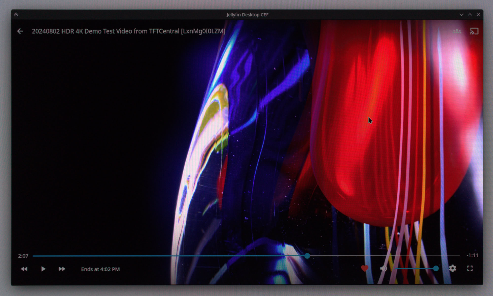
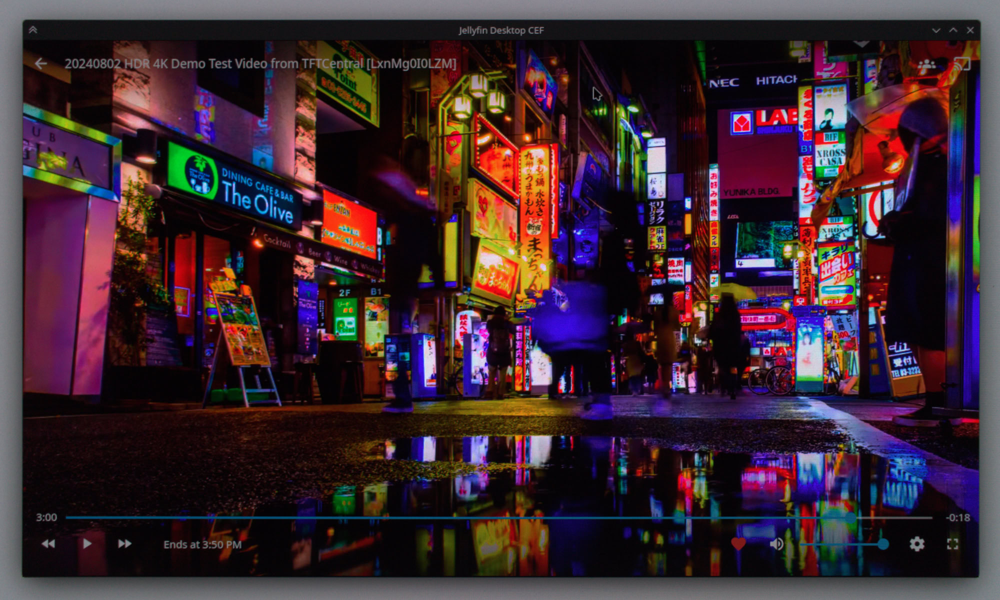

# Jellyfin Desktop CEF

Experimental rewrite of [Jellyfin Desktop](https://github.com/jellyfin/jellyfin-desktop) built on [CEF](https://bitbucket.org/chromiumembedded/cef).

- **CEF** - embedded Chromium browser
- **mpv** - forked libmpv: gpu-next, Vulkan, HDR passthrough (Wayland, macOS)
- **SDL3** - cross-platform window management and input

## Downloads
### Linux (X11 and Wayland)
- [AppImage](https://nightly.link/jellyfin-labs/jellyfin-desktop-cef/workflows/build-linux-appimage/main/linux-appimage-x86_64.zip)
- Arch Linux (AUR): [jellyfin-desktop-cef-git](https://aur.archlinux.org/packages/jellyfin-desktop-cef-git)
- [Flatpak (non-Flathub bundle)](https://nightly.link/jellyfin-labs/jellyfin-desktop-cef/workflows/build-linux-flatpak/main/linux-flatpak.zip)

### macOS
- [Apple Silicon](https://nightly.link/jellyfin-labs/jellyfin-desktop-cef/workflows/build-macos/main/macos-arm64.zip)

After installing, remove quarantine: 
```
sudo xattr -cr /Applications/Jellyfin\ Desktop\ CEF.app
```

### Windows
- [x64](https://nightly.link/jellyfin-labs/jellyfin-desktop-cef/workflows/build-windows/main/windows-x64.zip)
- [arm64](https://nightly.link/jellyfin-labs/jellyfin-desktop-cef/workflows/build-windows/main/windows-arm64.zip)


## Building

See [dev/](dev/README.md) for build instructions.

## Rationale
This experimental rewrite exists to test a number of things:
- is SDL3 + CEF a viable alternative to Qt [[1]](https://github.com/jellyfin/jellyfin-desktop/issues/1091)
- a non-upstream change to libmpv which adds gpu-next, Vulkan, and HDR support [[2]](https://github.com/andrewrabert/mpv/tree/libmpv-vulkan-gpu-next)
- the effectiveness of Claude Code as a tool to aid application rewrites

It is currently in a heavy state of development, but is largely functional on Linux and macOS. It's overall much snappier than the Qt Jellyfin Desktop, doesn't suffer from the Qt WebEngine memory leak [[1]](https://github.com/jellyfin/jellyfin-desktop/issues/1091), and works well enough to have become my primary desktop client.

The Linux and macOS builds for this project come bundled with the forked libmpv that *finally* gives Jellyfin users a way to watch HDR content on the desktop. Below are photos in an attempt to capture what actual HDR playback looks like ("grey" background under the window is actually pure `#ffffff` white) (source video [[3]](https://www.youtube.com/watch?v=LxnMg0I0LZM)).

|  |    |
| :--- | :--- |
|  |  |

